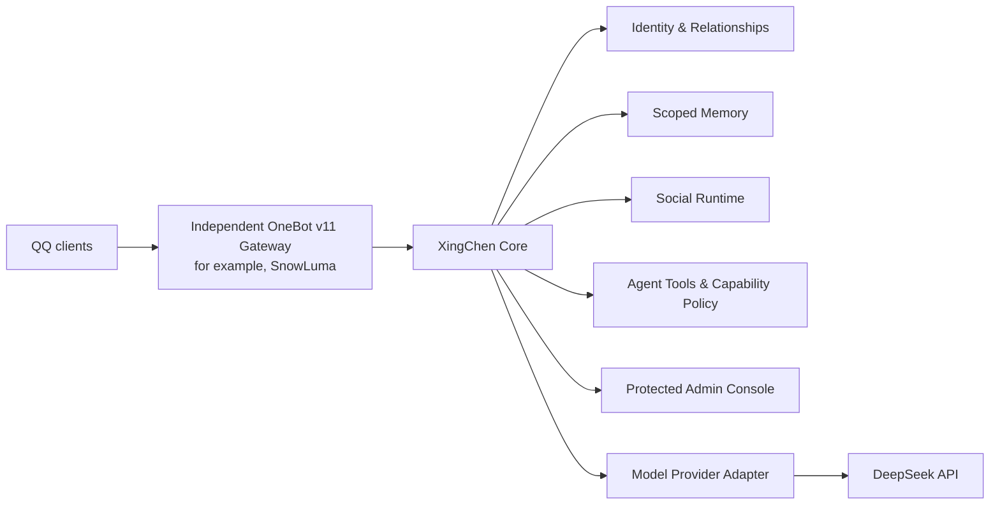

# XingChen Core / 星辰

面向 QQ 社交场景的 Java AI Agent Runtime。

**A Java social AI runtime with identity, memory, tools, OneBot, and a protected admin console.**

[](https://openjdk.org/projects/jdk/21/)
[](https://spring.io/projects/spring-boot)
[](LICENSE)
[](https://github.com/suisui0601a-pixel/XingChen/actions/workflows/ci.yml)

XingChen is a Java 21 application for building a social AI runtime around durable conversations, identity, relationships, memory, bounded agent tools, and model-provider adapters. It uses Spring Boot and SQLite and provides a protected bilingual administration console. QQ connectivity is provided by an independently deployed OneBot v11 gateway; that gateway is not part of this repository or container image.

## Current status

| Area | Status |
| --- | --- |
| Core runtime, persistence, and protected Admin Console | Implemented; automated tests available |
| Identity, relationships, and scoped memory | Implemented |
| Agent tools and capability policy | Implemented |
| DeepSeek provider and OneBot v11 integration | Implemented |
| QQ production message/tool round-trip | Operator-confirmed after deployment on 2026-10-05; see [production record](docs/PHASE5_PRODUCTION_GO_LIVE.md) |
| Voice features | In progress / not generally available |
| General public release | In progress |

This status describes the current development line, not an availability or support guarantee. See the source-available terms in [LICENSE](LICENSE).

## Architecture



The Gateway is a separate operator-managed service. XingChen does not contain QQ clients, login credentials, QR-login automation, or SnowLuma binaries.

Local development binds the Console to `127.0.0.1:3200`. In a container, the app
listens on its container interface for service-to-service traffic; deployment
examples publish only to host loopback by default and retain the explicit
remote-bind guard.

## Features

### Social runtime

- Private and group conversation handling through the OneBot v11 boundary.
- Durable, serialized turn processing with replay/deduplication and restart-aware state.
- Explicit wake and access policies rather than implicit unrestricted tool access.

### Identity and memory

- Stable platform identity and relationship/address-term management.
- Scoped memory with provenance and visibility controls.
- Prompt/persona configuration separated from transport and persistence contracts.

### Agent and integrations

- Provider-neutral model and tool contracts with provider-specific behavior kept in adapters.
- QQ, memory, sticker, and slang tool families subject to catalog and capability policy.
- DeepSeek tool-name transport mapping preserves XingChen's canonical internal names.

### Administration

- Protected bilingual Web Console for runtime, identity, prompts, models, OneBot, access, usage, and operations.
- SecretStore-backed provider and gateway credentials.
- Container deployment with non-root runtime, read-only root filesystem, and persistent data volume.

## Quick start

Requirements: JDK 21 and Docker Compose v2 for container deployment. The Gradle Wrapper downloads its pinned distribution on first use; frontend dependencies are installed by the build. For local development, see [Contributing](CONTRIBUTING.md).

```powershell
./gradlew.bat test
./gradlew.bat bootJar
```

For the hardened container, persistence, administrator initialization, and a separately managed OneBot Gateway, follow [Deployment](docs/DEPLOYMENT.md). Do not put secrets in Compose, Git, issue reports, or shell history.

`GET /health` is the basic liveness endpoint. Real provider tests are opt-in via
`./gradlew.bat liveTest`; they require the explicit live-test flag and a dedicated
test key. Normal tests use fixtures and do not call a provider.

## Documentation

- [Architecture](docs/ARCHITECTURE.md) · [Agent Runtime](docs/AGENT_RUNTIME.md) · [Memory Model](docs/MEMORY_MODEL.md)
- [Deployment](docs/DEPLOYMENT.md) · [Admin Initialization](docs/ADMIN_INITIALIZATION.md) · [Backup & Restore](docs/BACKUP_RESTORE.md)
- [Model Provider](docs/MODEL_PROVIDER.md) · [OneBot Adapter](docs/ONEBOT_ADAPTER.md) · [SnowLuma Gateway Contract](docs/SNOWLUMA_GATEWAY_CONTRACT.md)
- [Security](SECURITY.md) · [All documentation and historical reports](docs/README.md)

## Screenshots

No scrubbed, publishable console screenshots are included yet. We will add genuine screenshots only after reviewing them for credentials, private conversations, account identifiers, and infrastructure details. See [`docs/assets/screenshots/`](docs/assets/screenshots/).

## Security

Secrets do not belong in Git. The Console requires authentication, agent tools use capability allowlists, and the production container is configured non-root with a read-only root filesystem and no Docker socket. Keep the independently deployed Gateway isolated from public ingress. Provider diagnostics are sanitized; see [SECURITY.md](SECURITY.md) for the reporting process and deployment boundaries.

## License

XingChen is **source-available, not OSI open source**. Personal, learning, and non-commercial use are governed by [LICENSE](LICENSE); commercial use requires prior written authorization. Third-party components retain their own terms in [THIRD_PARTY_NOTICES.md](THIRD_PARTY_NOTICES.md).
